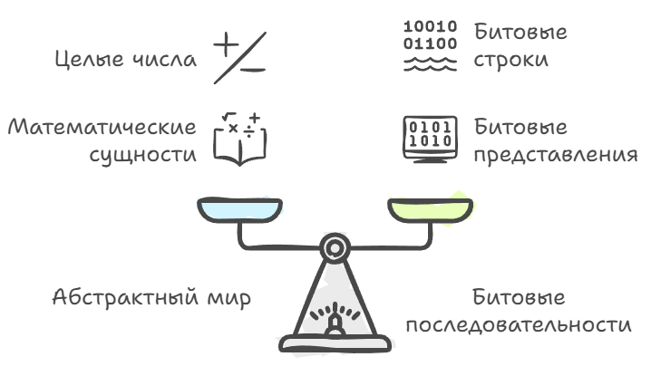
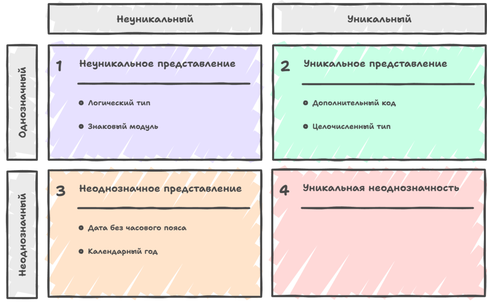

# Значения

Есть баг, от которого в игродеве дергается глаз у большинства разработчика сетевых игр. У всех игроков одна и та же сборка, тик сервера синхронизирован, но у кого-то противник стоит на два метра левее, чем у остальных, потом расходятся траектории гранат, потом расходится вся сцена, и если это игнорировать, то играть в такую игру не будут. В логах вы при этом ничего не найдете, по сети ничего не потерялось, и каждая машина честно посчитала одно и то же. Да посчитала... вот только не совсем одно и то же, сложив два числа в другом порядке, или оптимизатор на одной платформе свернул выражение, а на другой оставил как есть, или где-то положительный ноль встретился с отрицательным. Думаете мало в наших играх отрицательных нулей? Хватает, чтобы дальше расхождение множилось, переходя из кадра в кадр, пока не станет видимо глазу. Причина тут не в сети и не в логике игры, просто «одно и то же число» оказалось не одним и тем же, а слово «значение» устроено сложнее, чем кажется.

Чтобы прийти к природе описанного выше бага, разговор придётся начать с самого низа, с битов. Когда вы запускаете программу и смотрите на память, то никакого `C++`, никаких типов и даже никаких чисел там нет, а есть только длинные последовательности нулей и единиц. Процессор не знает, что такое «целое число 42», «вещественное 3.14» или «символ 'A'», и для него всё это разные способы прочитать одни и те же биты. Какое прочтение верное, в самих битах не написано, об этом договариваются программист, компилятор и архитектура.

### Данные, интерпретация и корректность

Возьмём 32 бита и договоримся читать их как целое со знаком. Битовых строк такой длины ровно 2³², целых чисел в допустимом диапазоне столько же, и каждой строке отвечает только одно число. Договорённость такого рода и называется типом значения: она говорит, какие битовые строки мы считаем корректными представлениями сущностей данного вида, а какие нет.

Если у нас есть конкретная сущность, скажем, целое число «минус пять», то набор битов, которым мы её кодируем в памяти, называется представлением этой сущности, а сама сущность, число как математический объект, является интерпретацией этих данных. Слово «значение» покрывает и то и другое сразу. Сказать «32 бита 1111…» значит не сказать ничего; значение это «32-битное знаковое целое в дополнительном коде со значением -5» или «пара 32-битных целых, читаемых как числитель и знаменатель рационального числа».



Например, обычный `int` на многих платформах: это 32 бита в дополнительном коде (two’s complement), где битовый набор 0x00000001 интерпретируется как число 1, а 0xFFFFFFFF как -1. Рациональное число можно представить как конкатенацию двух таких 32-битных целых, но не всякая последовательность битов является осмысленным представлением для произвольного типа значения. Можно говорить, что данные корректно сформированы относительно типа, если они действительно представляют какую-то абстрактную сущность этого вида.

Любая 32-битная последовательность, если мы договорились интерпретировать её как целое в дополнительном коде, будет корректно сформированной: каждый битовый набор соответствует какому-то целому от минимального до максимального. И это не просто свойство привычного нам железа: с `C++20` дополнительный код для знаковых целых записан в стандарте, так что вариантов с обратным кодом или со знаком и модулем в языке больше нет, а до этого они формально разрешались, хотя найти такую платформу сейчас уже негде.

Но если мы берём тип «вещественное число» в математическом смысле и пытаемся так прочитать произвольное значение IEEE 754, то рано или поздно наткнёмся на `NaN`. Эти биты по стандарту означают «Not a Number», и корректно сформированным представлением вещественного числа они не являются, но при этом в `C++` `NaN` вполне легальное значение типа `float`/`double`, которое можно хранить, копировать и передавать, а арифметика над ним живёт по своим правилам и чаще всего снова выдаёт `NaN`.

```cpp
    // Каждый из этих битовых наборов осмыслен как int
    uint32_t bits1 = 0x00000001u;
    uint32_t bits2 = 0xFFFFFFFFu;

    int32_t a, b;
    std::memcpy(&a, &bits1, 4); // 1
    std::memcpy(&b, &bits2, 4); // -1  (дополнительный код)
```

С плавающей точкой этот фокус уже не проходит, потому что там есть битовые наборы, которым не соответствует никакое вещественное число.

```cpp
    double y = std::nan("");   // «не число»

    std::cout << "y = "        << y                 << "\n";
    std::cout << "y + 1  = "   << y + 1             << "\n";
    std::cout << "y * 0  = "   << y * 0             << "\n";
    std::cout << "y == y = "   << (y == y)          << "\n";
    std::cout << "sqrt(-1) = " << std::sqrt(-1.0)   << "\n";
```

```text
y = nan
y + 1  = nan
y * 0  = nan
y == y = 0
sqrt(-1) = nan
```


### Полные и частичные типы

Тип, который выражает каждую сущность своего вида, называют полным; тип, который покрывает только часть, «собственно частичным». `int` частичен, как вы уже, наверное поняли, а вот цена этой частичности обычно недооценивается.

Дело в том, что частичность типа делает частичными и операции над ним, как пример, сложение двух совершенно корректных `int` может не иметь результата в `int`, и знаковое переполнение в `C++` это UB. Причём дыра есть даже там, где её не ждут и диапазон дополнительного кода несимметричен и отрицательных значений на одно больше, поэтому у `INT_MIN` нет противоположного, и `-INT_MIN` вместе с `std::abs(INT_MIN)` тоже UB. Взятие модуля, операция, которая выглядит определённой всюду, на одном значений не определена.

А на 16-битных системах `int` был в диапазоне -32768…32767, сейчас почти везде 32 бита, то есть примерно -2³¹…2³¹-1. При переходе к 64 битам сам `int` не вырос ни в одной модели, но в юниксовой LP64 вытянулся `long`, в виндовой LLP64 он остался 32-битным, и выросли только указатели, `long long` и `size_t`.

У `float` частичность тожен неравномерна, мантисса занимает 24 бита, поэтому шаг сетки представимых значений растёт вместе с самим числом. В метре от начала координат соседние значения отстоят на десятитысячные доли миллиметра, в километре примерно на 0,06 мм, в десяти километрах уже на миллиметр, в ста почти на сантиметр. В открытой карте мира это выглядит так, что у нуля всё гладко, а на краю мира объекты начинают мелко дрожать, потому что позицию притягивает к ближайшему узлу сетки, а узлы там редкие.

С полнотой получше. `bool` полон для логических значений, `enum class Suit` полон для мастей, потому что мастей ровно четыре и все четыре в нём есть. Польза от этого такая, что `switch` по полному типу закрывает все случаи и в `default` не нуждается.

```cpp
enum class Suit { Clubs, Diamonds, Hearts, Spades };

// вид конечен, тип покрывает его целиком, поэтому default не нужен,
// а -Wswitch напомнит, если в enum появится пятая масть
const char* to_string(Suit s) {
    switch (s) {
        case Suit::Clubs:    return "clubs";
        case Suit::Diamonds: return "diamonds";
        case Suit::Hearts:   return "hearts";
        case Suit::Spades:   return "spades";
    }
    return "?"; // недостижимо, пока в s лежит корректно сформированный Suit
}
```


### Уникальность представления и неоднозначность

Отдельная для практики тема, уникальность представления, то есть вопрос о том, соответствует ли каждой абстрактной сущности не более одного значения данного типа. Если у нас тип логического значения, реализованный как байт, где ноль, ложь, а любое ненулевое значение трактуется как истина, то представление не уникально: и 0x01, и 0xFF, и 0x7F интерпретируются как `true`, и вот уже равенство по смыслу не совпадает с равенством по битовому содержимому.

Тип, представляющий целое число в виде «знаковый бит плюс модуль» не имеет уникального представления нуля, потому что и «+0», и «-0» оказываются разными битовыми наборами. Формат дополнительного кода, наоборот, имеет уникальное представление, где каждое целое в допустимом диапазоне кодируется только одним набором битов, и ноль не имеет варианта «+0»/«-0». Компиляторы и процессоры любят такие типы с уникальным представлением, потому что операция равенства для них тривиально реализуется как побитовое сравнение, а оптимизатор может применять массу приёмов, основываясь на том, что замена равного на равное сохраняет и биты, и смысл.

Но бывает и наоборот, когда мы сознательно выбираем представление без уникальности или даже с неоднозначностью, если одно и то же значение может иметь более одной интерпретации. Тогда битам нельзя однозначно восстановить абстрактную сущность без дополнительного контекста.

Примером здесь будет календарный год, закодированный двумя десятичными цифрами: «42», что может означать и 1942, и 2042, и что угодно в зависимости от века, то есть одна и та же последовательность данных допускает несколько интерпретаций, и тип сам по себе неоднозначен, но у нас есть пример гораздо ближею

Сущности в игре обычно живут в массиве, у каждой есть индекс, по этому индексу её находят другие подсистемы, а когда сущность умирает, слот освобождается и потом достаётся новой. Индекс при этом остался тем же числом, только означает теперь другую сущность, и ссылка-число, которую кто-то придержал у себя дольше положенного, начинает указывать не туда, причём это худший вид «не туда», потому что там лежит живой валидный объект и ничего не падает. Битовая последовательность одна, интерпретаций две, и различить их по битам уже нельзя, потому что контекста в них нет.

Лечится это добавлением в представление недостающий контекст. Рядом с индексом кладут счётчик поколения, и ссылка становится парой, где младшая часть говорит, куда смотреть, а старшая, к какому поколению слота ссылка относилась. Просроченная ссылка теперь отличается от свежей по битам, и её можно отвергнуть на входе.

> Та же болезнь живёт далеко за пределами игрового цикла. Дата, сохранённая без часового пояса, занимает меньше места и быстрее сравнивается, но битовое равенство перестаёт что-либо гарантировать: два одинаковых набора битов означают разные моменты времени, а один и тот же момент, записанный в двух зонах, даёт разные биты.



### Два равенства и цена сравнения

Чтобы аккуратно различать эти ситуации, надо различать два вида равенства: равенство как совпадение интерпретаций и «представительное» равенство как дословное совпадение битовых последовательностей. Два значения одного типа равны, если они описывают одну и ту же абстрактную сущность; они представительно равны, если последовательности нулей и единиц в их памяти идентичны.

Если у типа есть уникальное представление, то равенство по смыслу автоматически влечёт равенство по битам, потому что для каждой сущности существует только одно законное представление. Если тип не является неоднозначным, то есть каждая битовая последовательность соответствует не более чем одной сущности, то наоборот, представительное равенство влечёт равенство по смыслу: одинаковые биты, одинаковая сущность.

Поэтому для обычного `int` в дополнительном коде оператор `==` по сути совпадает с сравнением представлений, когда одинаковый смысл означает одинаковые биты, и наоборот. У `double` картина другая и машинное сравнение (`==` по IEEE 754) не является ни чистым сравнением битов, ни чистым математическим равенством: `+0.0 == -0.0` даёт `true` при разных битах, а `NaN == NaN` даёт `false` даже когда битовые образы совпадают. Компилятор всё равно сводит это к одной-двум инструкциям, но работают они по правилам плавающей точки, и на «memcmp по восьми байтам» это не похоже.

Но в реальной жизни мы часто сталкиваемся с типами, где уникальность представления сознательно нарушена ради эффективности операций создания и преобразования значений. Рациональные числа, хранящиеся как пары целых числителя и знаменателя без автоматического сокращения дроби, классический пример: 1/2 и 2/4 представляют одну и ту же абстрактную сущность, но имеют разные представительные формы, и чтобы проверить их равенство по смыслу, нужно либо привести обе дроби к несократимому виду, либо перемножить и сравнить произведения, что намного дороже простого сравнения двух пар битовых узоров.

У сравнения через произведение есть своя цена: `num * o.den` легко переполняет `int64_t`, а знаковое переполнение в `C++` это UB. Для учебного примера сойдёт, но в рабочем коде понадобится либо более широкая арифметика, либо сравнение через сокращение. И раз речь идёт о корректно сформированных представлениях, то знаменатель обязан быть отличным от нуля, а его знак надо привести к плюсу, причём делать это должен код, а не комментарий рядом с полем, иначе тип разрешает собрать значение, которое ничего не представляет.

```cpp
#include <cassert>

// Неуникальное представление
struct Rational {
    int64_t num; // числитель
    int64_t den; // знаменатель, строго больше нуля

    // Инвариант держим здесь, а не в комментарии рядом с полем,
    // иначе корректность представления остаётся на честном слове
    static Rational make(int64_t n, int64_t d) {
        assert(d != 0);
        return d > 0 ? Rational{n, d} : Rational{-n, -d};
    }

    // сравнение представлений, быстро и не про смысл
    bool naive_eq(const Rational& o) const {
        return num == o.num && den == o.den;
    }
    // медленная проверка с нормализацией
    bool normalized_eq(const Rational& o) const {
        auto g1 = std::gcd(num, den);
        auto g2 = std::gcd(o.num, o.den);
        return (num / g1) == (o.num / g2) && (den / g1) == (o.den / g2);
    }
    // медленная проверка с перемножением
    // осторожно: num * o.den может переполнить int64_t
    bool cross_eq(const Rational& o) const {
        return num * o.den == o.num * den;
    }
};

void demo_rational() {
    auto a = Rational::make(1, 2); // 1/2
    auto b = Rational::make(2, 4); // 2/4, та же абстрактная сущность

    std::cout<<"1/2 naive_eq 2/4:"<<a.naive_eq(b)<<"\n"; // 0, представления разные, а сущность одна
    std::cout<<"1/2 normalized_eq 2/4:"<<a.normalized_eq(b)<<"\n"; // 1
    std::cout<<"1/2 cross_eq 2/4:"<<a.cross_eq(b)<< "\n"; // 1
}
```

С поворотами будет та же история, кватернион `q` и кватернион `q'`, у которого перевёрнуты знаки всех четырёх компонент, задают один и тот же поворот, то есть это одна абстрактная сущность, но в памяти это разные байты, потому что у каждой компоненты перевёрнут знаковый бит. Представление снова неуникально, причём здесь мы на это не соглашались ради скорости, оно так устроено само по себе, и обойти это нельзя.

Для нас это означает, что побитовое сравнение двух поворотов бесполезно, и равенство приходится считать через скалярное произведение, причём по модулю, потому что знак нам как раз безразличен. А если наивно интерполировать между этими двумя представлениями, анимация будет сделана через длинную сторону и персонаж вывернет руку не туда, например при хвате оружия, потому что мы взяли два разных представления одной и той же сущности и стали усреднять их биты вместо того, чтобы сравнить по смыслу. Поэтому в интерполяции поворотов первым делом смотрят на знак скалярного произведения и при необходимости разворачивают один из кватернионов.

```cpp
// Один поворот, два представления: q и -q
struct Quat { float x, y, z, w; };

static float dot(const Quat& a, const Quat& b) {
    return a.x * b.x + a.y * b.y + a.z * b.z + a.w * b.w;
}

// Побитово разные, по смыслу один и тот же поворот
bool same_rotation(const Quat& a, const Quat& b, float eps = 1e-5f) {
    return std::abs(dot(a, b)) > 1.f - eps; // модуль, потому что знак не важен
}
```

Другой пример - это конечные множества. Их можно хранить как неотсортированные списки, и тогда проверка равенства требует сортировки и удаления дубликатов, прежде чем сравнивать элемент за элементом. Получаем то же, что и с дробями, когда вставка дешевеет, равенство дорожает, что разумно пока вы сравниваете реже, чем добавляете. В контейнерах стандартной библиотеки видно то же самое: у дерева (`std::set`) дёшевы упорядоченный обход и поиск по компаратору, но вставка логарифмическая и тянет аллокации; у хеш-таблицы (`std::unordered_set`) вставка и проверка принадлежности в среднем дешевле, зато равенство и хеш обязаны быть согласованы, а качество хеш-функции и худшие случаи становятся отдельной статьёй расходов.

```cpp
// вставка дешёвая, равенство дорогое
struct UnsortedSet {
    std::vector<int> elements; // порядок и дубликаты произвольные

    void insert(int x) {                              // O(1)
        elements.push_back(x);
    }

    bool operator==(const UnsortedSet& other) const { // O(n log n)
        auto a = elements;
        auto b = other.elements;
        std::sort(a.begin(), a.end());
        std::sort(b.begin(), b.end());
        a.erase(std::unique(a.begin(), a.end()), a.end());
        b.erase(std::unique(b.begin(), b.end()), b.end());
        return a == b;
    }
};

// тот же вид, размен наоборот
struct SortedSet {
    std::vector<int> elements; // инвариант: отсортирован, без дубликатов

    void insert(int x) {                              // O(n), сдвиг хвоста
        auto it = std::lower_bound(elements.begin(), elements.end(), x);
        if (it == elements.end() || *it != x) {
            elements.insert(it, x);
        }
    }

    bool operator==(const SortedSet& other) const {   // O(n)
        return elements == other.elements;
    }
};
```


### Когда равенство недостижимо

Иногда реализовать «настоящее» поведенческое равенство слишком дорого или даже теоретически невозможно. Ксли вы представляете вычислимую функцию как некоторый кусок кода или структуру данных, описывающую алгоритм, то понятие «две функции равны, если они дают одинаковый результат на всех возможных аргументах» оказывается неразрешимым.

В общем случае невозможно алгоритмически проверить, что два произвольных алгоритма ведут себя одинаково на всей области определения, это следствие теоремы Райса, и тогда приходится довольствоваться более слабым понятием равенства, сравнением представлений, когда два значения считаются равными, только если их битовые образы совпадают, тогда мы допускаем, что это один и тот же объект в памяти или точная копия.

Значения при этом живут в памяти и имеют адреса, но корректно реализованная функция ведёт себя так, будто адреса ей безразличны, потому она смотрит только на содержание аргументов, и если скопировать значение в другое место, результат применения функции к старой и новой копии будет одинаков.

### Регулярность и подстановка

Когда мы говорим, что функция определена на типе значений и является регулярной, мы имеем в виду, что она «уважает» равенство и если заменить аргумент на любое другое равное ему значение, результат функции не изменится. Для обычных конечных `double` при фиксированном режиме округления привычные операции вроде `+`, `*` или `sin` регулярны, т.е. равные по `==` входы дают равный по `==` результат. Стоит выйти за пределы конечных чисел, и картина ломается, и ломают её `NaN` и знак нуля.

С точки зрения теории типов и оптимизатора компилятора это важное замечание, потому что такие функции позволяют применять подстановку и заменять выражения на равные им без изменения поведения программы, а нерегулярные функции этого не допускают, и внутри них выбор результата может зависеть от того, каким именно битовым образом записано значение.

```cpp
double pos_zero =  0.0;
double neg_zero = -0.0;

std::cout<<"\n+0.0 == -0.0:"<<(pos_zero == neg_zero)<<"\n";
// 1, равны по ==

std::cout<<"signbit(+0.0):"<<std::signbit(pos_zero)<<"\n";
// 0

std::cout<<"signbit(-0.0):"<<std::signbit(neg_zero)<<"\n";
// 1, результат другой!
// signbit нарушает регулярность:
// заменили равное на равное, но результат изменился
```

В истории компиляторов для `C++` это различие многократно всплывало в дискуссиях о допустимых оптимизациях: можно ли, например, переупорядочивать вычисления с плавающей точкой или заменять выражения на эквивалентные с математической точки зрения, если формат IEEE 754 и наличие `NaN`, бесконечностей и тонкостей с округлением делают многие привычные тождества, вроде ассоциативности сложения, ложными.

```cpp
float a = 1e15, b = -1e15, c = 1.5;

float left  = (a + b) + c; // (1e15 - 1e15) + 1.5 = 0 + 1.5 = 1.5
float right = a + (b + c); // 1e15 + (-1e15 + 1.5), потеря точности

std::cout << "\n(a+b)+c = " << left  << "\n"; // 1.5
std::cout << "a+(b+c) = " << right << "\n"; // может отличаться
std::cout << "Равны:   " << (left == right) << "\n";
// С -ffast-math компилятор мог переставить и получить иной результат
```

```text
(a+b)+c = 1.5
a+(b+c) = 0
Равны:   0
```

Комитет стандарта и разработчики компиляторов искали баланс между желанием агрессивно оптимизировать код и необходимостью сохранить корректность для тех функций и типов, которые программист считает регулярными, и в результате появились режимы вроде `-ffast-math` в GCC и Clang и `/fp:fast` в MSVC, которые сознательно ослабляют гарантию регулярности ради производительности. В игровых проектах такой флаг встречается сплошь и рядом, потому что кадр обычно важнее последнего бита мантиссы, но расплата за это приходит позже, когда одна и та же сцена считается чуть по-разному на двух машинах и реплей расходится с оригиналом. Это называется десинк, с которого началась глава, и теперь вам должно быть понятно, почему в логах было чисто: по сети ничего не потерялось, но почему разошлись сами значения.

Проектируя тип, эти два вопроса приходится решать вместе: какое равенство вы хотите иметь, битовое или поведенческое, с уникальным представлением или без, и какие функции над типом обязаны остаться регулярными, чтобы вы и компилятор могли безопасно подставлять равное вместо равного.