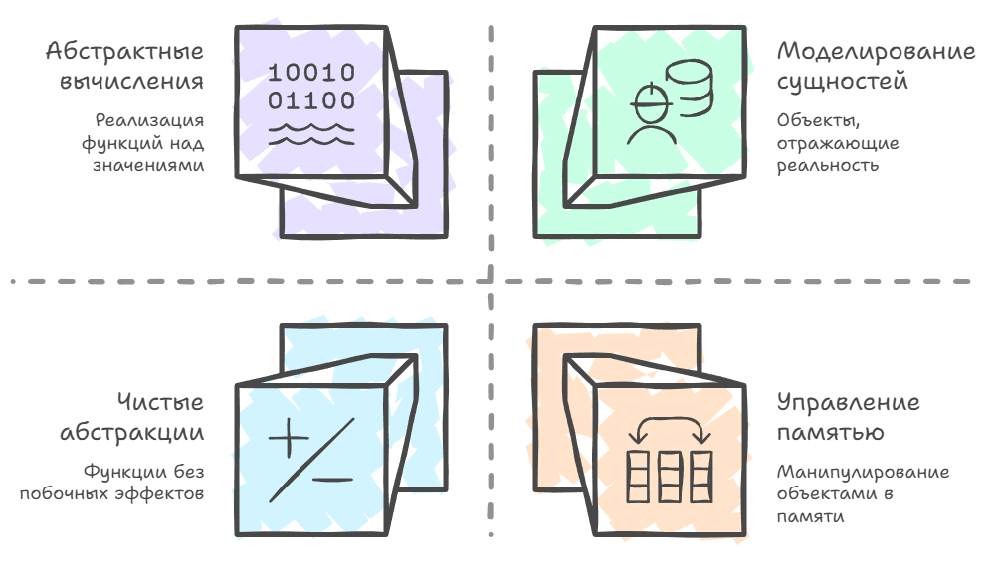
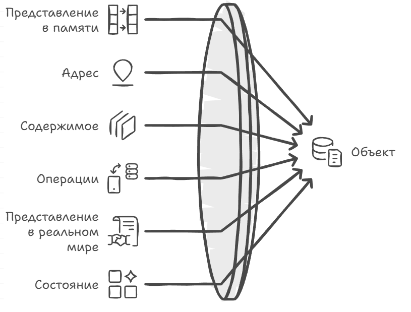
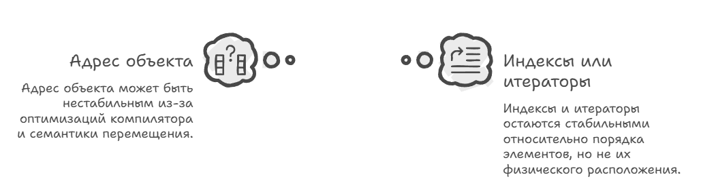

# Объекты

Начну с истории, которая в том или ином виде случалась у каждого разработчика, кто делал логику для игровых юнитов. Условная башня держит указатель на свою цель и юнит под обстрелом умирает, память возвращается в пул юнитов, но через кадр в том же самом слоте появляется новый юнит, только что заспавненный на другом конце карты. Указатель у башни при этом не изменился и по-прежнему указывает на живой валидный объект правильного типа, у которого читаются поля и вызываются методы, поэтому ничего не падает. Но для игрока это будет выглядеть как баг или странное поведение, потому что башня вдруг перестаёт стрелять (новый юнит в старом слоте оказался за радиусом стрельбы), хотя других врагов вокруг неё полно. Дело в том, что указатель всё это время отвечал на вопрос «где лежит», а башня спрашивала у него «кто это», и пока прежний юнит был жив, оба вопроса давали один и тот же ответ, но «где лежит» и «кто это» вопросы разных уровней, их можно смешать, но не взбалтывать.

Чтобы понять, откуда вообще берётся это различие между «где лежит» и «кто это», придётся спуститься на пару этажей ниже по архитектурной лестнице. Когда мы в программировании произносим слово «объект», очень легко сразу прыгнуть к классам, методам и всякой ООП-атрибутике, хотя на самом деле всё начинается с памяти и того, как в ней живут биты. Представьте себе память как большое поле ячеек, у каждой есть адрес (тоже число) и содержимое фиксированной ширины (слово или байт, набор битов). Чтобы прочитать слово по адресу, процессор делает load, а для изменения связи «адрес → содержимое» делает store. В современных машинах эту роль играют области в оперативной памяти, а на диске ту же модель реализуют блоки на SSD или HDD, только с другими задержками и правилами, но принцип тот же, есть адрес, есть содержимое, есть чтение и запись.

## Объект как договор

На этом фоне объект можно понять как договор между программистом, компилятором и машиной о способе представления конкретной сущности из нашего предметного мира в виде значения, живущего в памяти. У каждого объекта есть состояние, и это состояние будет просто значением некоторого типа. Если объект описывает того юнита из истории выше, то его состоянием в текущий момент будет «снимок» всех атрибутов, которые мы решили хранить. Это позиция на карте, запас здоровья, текущая цель, номер команды.

Это состояние может меняться во времени, и именно этим объект отличается от простого значения, потому что значение само по себе, как математическое представление, неизменно, а объект способен в разные моменты времени иметь разные значения. Юнит поймал снаряд, и в поле здоровья вместо 80 стало 60, но само число 80 при этом никуда не делось и не стало другим числом, изменился объект, который его хранил. Чтобы хранить своё состояние, объект владеет набором ресурсов, и это могут быть слова памяти в куче, записи в файле, элементы в базе данных, а в простейшем случае это просто несколько байтов подряд, отданных локальной переменной на стеке.

Зачем вообще нужны объекты? Причина в устройстве реальных компьютеров. Они, как и классическая машина Тьюринга, опираются на память с состоянием, поэтому даже «чистые» функции на уровне языка в итоге исполняются через чтение и запись ячеек, регистров и кэша, то есть через манипуляцию конкретными объектами или их кратковременными копиями в регистрах. Так что даже когда нас интересует чисто абстрактное значение, вроде квадратного корня числа или решения системы линейных уравнений, считаем мы его алгоритмом поверх изменяемой памяти, итерационными методами и накоплением промежуточных сумм, и объект оказывается тем инструментом, которым значения вычисляют. А то, что объектами заодно удобно моделировать изменчивые сущности, юнита в игре, запись о сотруднике или состояние окна в GUI, скорее приятное следствие, чем причина.



## Где физически лежит значение

Договор договором, а посмотреть, как значение на самом деле лежит в памяти, всё равно придётся. Возьмём того же юнита, у которого есть позиция, здоровье и состояние ИИ, и разложим массив таких юнитов очевидным способом, когда поля находятся рядом.

```cpp
// массив структур: поля одного юнита лежат рядом
struct Unit_AoS {
    float x, y, z;  // позиция на карте
    int hp;         // здоровье
    int ai_state;   // состояние ИИ
};

void example_aos() {
    std::vector<Unit_AoS> units = {
        {10.0f, 0.0f, 5.0f, 100, 0},
        {12.0f, 0.0f, 7.0f,  80, 1},
        {14.0f, 0.0f, 9.0f,  60, 2}
    };

    // обращение естественное, весь юнит под рукой
    std::cout << "AoS: " << units[1].x << ", " << units[1].z
              << ", hp " << units[1].hp << "\n";
}
```

```text
===================================================================
ARRAY OF STRUCTURES (AoS), классическое представление
===================================================================

Память (байты идут подряд):

  ┌─────────────────────────────┬─────────────────────────────┐
  │           Unit[0]           │           Unit[1]           │
  ├─────┬─────┬─────┬─────┬─────┼─────┬─────┬─────┬─────┬─────┤
  │  x  │  y  │  z  │ hp  │ ai  │  x  │  y  │  z  │ hp  │ ai  │
  │10.0 │ 0.0 │ 5.0 │ 100 │  0  │12.0 │ 0.0 │ 7.0 │  80 │  1  │
  └─────┴─────┴─────┴─────┴─────┴─────┴─────┴─────┴─────┴─────┘

  0x1000                        0x1014                        0x1028
```

Но хотя мы логически думаем о значении объекта как о непрерывной последовательности нулей и единиц, физически ресурсы, в которых эти биты хранятся, не обязаны идти подряд. Тот же юнит хороший пример, и его позиция это тройка `float`, которая может лежать одним куском внутри структуры, а может быть разнесена по разным массивам, и всё равно интерпретация будет собирать её в одно логическое целое. Если мы вручную перешли от массива структур {x, y, z, hp, ai}[] к отдельным массивам x[], y[] и z[], то поля одного логического юнита физически живут в разных регионах памяти. В `C++` это всё равно отдельные объекты типа `float` (плюс, может быть, обёртка вроде `PositionRef`), а «один юнит» здесь означает соглашение нашей программы об интерпретации, а не один объект языка.

Разносят поля, разумеется, не из любви к теории. Возьмите миллион сущностей, у которых проверяется только позиция. Если процессор будет ходить в память кэш-линиями по 64 байта, то в раскладке «массив структур» вместе с нужными тремя float в кэш приедет весь остальной юнит, то есть здоровье, состояние ИИ, ссылки на модель и всё, что там ещё накопилось за годы разработки. Большая часть трафика памяти уйдёт на данные, которые в этом цикле никому не нужны, но разложите те же сущности как «структуру массивов», и позиции лягут подряд, каждая линия окажется забита только тем, что сейчас нужно, и на горячих циклах разница во времени обработки перестаёт измеряться процентами, как только юнит достаточно толстый.

Посчитать её можно на салфетке, что называется, как отношение размера юнита к размеру его горячих полей. В нашем учебном `Unit_AoS` полезные двенадцать байт позиции соседствуют с восемью лишними, так что выигрыш выйдет скромный, меньше двух раз, и городить ради него две раскладки незачем. Но настоящий юнит в движке весит сотню байт с лишним, и тогда каждая 64-байтная линия отдаёт вам всё те же двенадцать байт позиции, а остальное просто занимает шину и кэш. В «структуре массивов» линия массива x[] привозит шестнадцать координат подряд и ни одного лишнего байта, так что трафик памяти отличается впятеро, а это уже не вопрос вкуса.

```cpp
// структура массивов: поля одного юнита разнесены по памяти
struct UnitArray_SoA {
    std::vector<float> x;   // все координаты x подряд
    std::vector<float> y;   // все y
    std::vector<float> z;   // все z
    std::vector<int> hp;    // здоровье отдельным массивом

    size_t size() const { return x.size(); }

    // позиция юнита i это (x[i], y[i], z[i]), три ссылки в разные массивы,
    // а не один объект языка, на который можно взять указатель
    struct PositionRef {
        float& x;
        float& y;
        float& z;

        PositionRef(float& px, float& py, float& pz): x(px), y(py), z(pz) {}

        void print() const {
            std::cout << x << ", " << y << ", " << z << "\n";
        }
    };

    PositionRef position(size_t i) {
        return PositionRef(x[i], y[i], z[i]);
    }
};

void example_soa() {
    UnitArray_SoA units;
    units.x  = {10.0f, 12.0f, 14.0f};
    units.y  = { 0.0f,  0.0f,  0.0f};
    units.z  = { 5.0f,  7.0f,  9.0f};
    units.hp = {  100,    80,    60};

    std::cout << "SoA: ";
    units.position(1).print();

    // горячий цикл трогает только позиции, и они лежат подряд
    for (size_t i = 0; i < units.size(); ++i) {
        units.x[i] += 1.0f;
    }
}
```

```text
===================================================================
STRUCTURE OF ARRAYS (SoA), разнесённое представление
===================================================================

Память (массивы в разных местах):

  Массив x[] (все координаты x):
  ┌────────┬────────┬────────┐
  │  10.0  │  12.0  │  14.0  │  ← x[0], x[1], x[2]
  └────────┴────────┴────────┘
  0x2000   0x2004   0x2008

  Массив y[] (все координаты y):
  ┌────────┬────────┬────────┐
  │   0.0  │   0.0  │   0.0  │  ← y[0], y[1], y[2]
  └────────┴────────┴────────┘
  0x3000   0x3004   0x3008

  Массив z[] (все координаты z):
  ┌────────┬────────┬────────┐
  │   5.0  │   7.0  │   9.0  │  ← z[0], z[1], z[2]
  └────────┴────────┴────────┘
  0x4000   0x4004   0x4008

Логическая позиция Unit[1] = {x[1], y[1], z[1]}
                           = {12.0 из 0x2004, 0.0 из 0x3004, 7.0 из 0x4004}
```



Платить за это приходится не только красотой кода, теперь у логической сущности больше нет одного адреса, а взять на неё указатель или ссылку целиком не получится, только собрать обёртку из ссылок на поля вроде `PositionRef` выше. И если проход, наоборот, трогает все поля сразу, SoA проигрывает, потому что вместо одной кэш-линии вы тянете столько независимых потоков памяти, сколько у вас массивов.

Салфетка салфеткой, но давайте померяем, что получается на реальном железе. На моей машине (обходили миллион юнитов) проход по одним позициям занял 46,07 мс на юните в сто двадцать восемь байт, 16,17 мс на структуре массивов и 15,98 мс на нашем учебном двадцатибайтном, то есть толстая раскладка отстала в 2,85 раза, а тонкая не отстала вообще, хотя должна была отставать раза в полтора. Проход по всем полям меняет картину, подсказывая, почему так получается, там это заняло 35,61 мс у массива структур против 39,38 мс у структуры массивов. Самое интересное получилось на размере выборки, на ста тысячах сущностей разницы не было никакой, потому что сто тысяч юнитов по сто двадцать восемь байт это 12,8 МБ, а L3 на этой машине 24 МБ, весь массив уезжает в кэш, т.е. замерять там мало что можно. Числа с одной машины, но порядок величин показателен.

> Откуда взялась ничья? Обе раскладки поднимают из памяти одинаковые двадцать байт на юнит, поэтому десять процентов разницы это чистая плата за то, что массив структур идёт по памяти одной колонной, а структура массивов пятью сразу, и процессору приходится держать в уме пять мест вместо одного, откуда брать данные для работы. На проходе по позициям структура массивов платит столько же, а забирает всего на сорок процентов меньше байтов, вот одно и съедает другое.

В распределённых системах ресурсы одной логической сущности и вовсе могут оказаться в разных видах памяти, например часть в оперативной, часть на диске или в удалённом хранилище, но обычно, говоря об объекте в `C++`, мы подразумеваем один процесс и одно адресное пространство.

## Тип объекта и тип значения

Тип объекта в такой картине мира это шаблон того, как мы храним и меняем значения в памяти, и можно сказать, что для каждого типа объекта существует соответствующий тип значения, который описывает все допустимые состояния объектов этого типа.

Если мы договорились, что здоровье юнита это 32-битное знаковое целое в формате дополнительного кода с порядком байтов little-endian и выравниванием по границе 4 байта, то мы тем самым задали конкретный тип объекта, и компилятор теперь знает, какой размер у него в байтах, где он может располагаться в памяти, какие инструкции процессора использовать для загрузки и записи. Типом значения для этого объекта будет множество всех целых чисел в допустимом диапазоне. Весь этот договор за нас подписали язык и ABI платформы, а наша доля начинается там, где тип становится своим, и раскладку, инварианты и набор допустимых состояний выбираем уже мы.

Теперь любой конкретный объект `int` в программе принадлежит этому типу объекта, его состоянием будет некоторое конкретное значение, а физической реализацией набор байтов в памяти по известному адресу, а если объект лежит внутри структуры, то по смещению от её начала, но значения и объекты взаимодополняющие, при этом принципиально разные по ролям.

Сами объекты привязаны к конкретной машине и реализации, у них есть адрес, набор байтов и механика изменения, и они переходят из одного состояния в другое в течение жизни программы. Взять «снимок» такого состояния несложно, достаточно посмотреть на `std::string` как на последовательность символов и сериализовать её в JSON.

Когда мы обсуждаем равенство объектов, мы чаще всего хотим говорить именно о равенстве их состояний как значений, абстрагируясь от того, что один `std::string` хранит свои данные в одном участке памяти, а другой, в другом. Такой взгляд особенно привычен в языках с упором на неизменяемые данные (где изменение состояния либо запрещено, либо вынесено на край), но и в `C++` он позволяет отделить «что» от «как» и не привязывать всё к конкретным адресам.

Часть свойств типов значений переносится и на типы объектов. Если значение корректно сформировано и его двоичное представление допустимо для выбранного типа, то корректен и объект с таким состоянием. Если тип значений частичен, как `int` по отношению ко всем целым, то частичен и соответствующий тип объектов, а если представление уникально, как у целых в дополнительном коде, равенство по смыслу для таких объектов часто совпадает с равенством представлений.

Про последнее можно спросить в коде. `std::has_unique_object_representations_v<T>` отвечает «да», когда у типа нет дыр выравнивания и любые два равных по смыслу объекта побитово совпадают. Дыры при этом не единственная помеха, `float` уложен без единого лишнего байта, а трейт всё равно отвечает «нет», и по знакомой из главы о значениях причине, у нуля два представления, «+0» и «-0» равны по смыслу и различаются битом знака. Тем же условием пользуются оптимизаторы, у `LLVM` есть отдельный проход `MergeICmps`, который склеивает цепочку сравнений полей в один `memcmp`, когда поля идут подряд и дыр между ними нет. MSVC на структуре из четырёх `int` с дефолтным `operator==` этого не делает и оставляет по сравнению на каждое поле.

Без такого разрешения приём разваливается и «слепой» `operator==` через `memcmp` по всей структуре с дырами выравнивания даёт ложные неравенства, потому что содержимое байтов паддинга стандарт не обещает вообще. Откуда эти дыры берутся и как их убирают перестановкой полей, разберём в главе про хранение, здесь дыра нужна нам только тем, что ломает побайтовое сравнение.

```cpp
struct Shot {
    char team;    // 1 байт
    int  damage;  // 4 байта, а перед ними три байта дыры
};

static_assert(sizeof(Shot) == 8);
static_assert(!std::has_unique_object_representations_v<Shot>);  // мешает дыра
static_assert(std::has_unique_object_representations_v<int>);    // а тут дыр нет
static_assert(!std::has_unique_object_representations_v<float>); // дыр нет, а ответ «нет»

void padding_demo() {
    Shot a;
    Shot b;
    std::memset(&a, 0x00, sizeof a);  // весь объект нулями, вместе с дырой
    std::memset(&b, 0xFF, sizeof b);  // а этот единицами

    a.team = 'A';  a.damage = 30;
    b.team = 'A';  b.damage = 30;

    assert(a.team == b.team && a.damage == b.damage);  // поля совпали

    // memcmp сравнивает и дыру, содержимое которой стандарт вообще
    // никак не обещает, так что тут он почти наверняка скажет "не равны"
    std::cout << "memcmp: " << std::memcmp(&a, &b, sizeof a) << "\n";
}
```

Поэтому сравнение пишут по полям, а побайтовое оставляют тем типам, про которые язык сам ответил, что они побитово совпадают.

## Жизнь объекта

Всё это время мы говорили об объекте как о договоре, а в языке есть и своё определение, объект занимает область хранения и имеет тип, продолжительность хранения и время жизни. Про тип и область мы уже поговорили, а вот время жизни в разговоре ещё не появлялось, хотя без него половина сказанного работать не будет.

Память под объект находят раньше, чем он начинается, потому что начинается он с окончанием инициализации, а заканчивается, когда начал работать деструктор, т.е. до первого момента и после второго по тому же адресу лежат вполне живые байты, но самого объекта там нет. Это приводит нас к идее разъехавшихся сроков, когда память и объект могут жить физически разное время и буфер вектора может существовать дольше, чем элементы внутри него, переживая несколько поколений этих элементов.

В играх на этом устроено всё, что должно работать быстро. Память под снаряды, партиклы или юниты выделяют один раз на матч или на кадр, а внутри этой памяти объекты появляются и умирают тысячами, и если снаряд отработал и его деструктор уже прошёл, то через кадр на том же самом месте будет уже другой снаряд. Хотя адрес и совпал физически, но объект будет другой. Никакого нарушения правил тут не будет, а такая техника называется пулом и переиспользует одну область памяти под целые поколения объектов, позволяя управлять ими группой.

```cpp
struct Projectile { int id; float ttl; };

// Один слот памяти, в разное время в нём живут разные объекты.
// Подробный разговор про размещение объектов в готовой памяти будет позже,
// сейчас важно только то, что адрес совпадает, а объекты разные.
alignas(Projectile) unsigned char slot[sizeof(Projectile)];

void pool_demo() {
    Projectile* first = new (slot) Projectile{1, 0.5f};
    first->~Projectile();                   // время жизни первого закончилось

    Projectile* second = new (slot) Projectile{2, 1.0f};
    assert((void*)first == (void*)second);  // то же самое место
    second->~Projectile();                  // но объект тут был уже другой
}
```

Здесь появляется разгадка истории из начала главы. Башня держала указатель, но пул отдал это место (и этот указатель) следующему юниту по правилам, и с точки зрения нашей системы тут нет ошибок, потому что время жизни цели закончилось, началось время жизни нового юнита, а указатель показывает на живой объект правильного типа. Память тут отработала как договаривались, а сломалось наше предположение, что один и тот же указатель является ответом на вопрос «кто это». Но сырой указатель умеет отвечать только на вопрос «где лежит».

## Идентичность

Из этой ошибки и появляется понятие идентичности объектов, потому что в реальном мире конкретные сущности остаются собой даже при полной смене состояния. Юнит за матч успел сменить позицию, потерять три четверти здоровья, подобрать другое оружие и после захвата перейти под контроль соседнего игрока, но в логе матча и в таблице результатов это по-прежнему он. Аккаунт остаётся тем же аккаунтом, даже если у него сменились ник, аватар и рейтинг.

Этот вопрос сильно старше программирования и отсылает к кораблю Тесея, у которого по доске заменили всю обшивку. Будет ли он тем же самым кораблём или уже другим? А человек, у которого в течение некоторого времени обновляются все клетки тела, остаётся ли он тем же человеком? Пул из предыдущего раздела задаёт ту же загадку с другого конца, обшивка там осталась на месте, а корабль подменили, и башня повелась именно на это.

Чтобы отразить это знание в программе, сущности нуждаются в определении идентичности, отделённом от текущего состояния. Удобнее всего завести токен идентичности, уникальное значение «кто это». Таким токеном может быть адрес, но как мы видели иногда это плохой пример, или индекс в массиве, или табельный номер в кадровой системе. Не смешивайте уровни, потому что равенство адресов отвечает на вопрос «то же самое место в памяти?», а равенство табельных номеров или entity id, на вопрос «та же предметная сущность в нашей модели?».

И даже первый вопрос не совпадает с «тот же объект?», потому что один адрес законно делят вложенные друг в друга объекты, скажем базовый подобъект и производный объект или структура и её первое поле, а после конца времени жизни, как мы только что видели на пуле, адрес достаётся следующему объекту. Индекс в `vector` ближе ко второму (позиция в коллекции) и сам по себе не переживает произвольные перестановки без дополнительной дисциплины.

На протяжении жизни программы токен идентичности может смениться, например элемент «переехал» в другой буфер после реаллокации, запись получила новый ключ или сущность сменила handle. В модели `C++` сам объект при этом часто уже другой (старый уничтожен, и новый создан по другому адресу) или то же хранилище с тем же адресом, но иным состоянием после `move`. Логическая идентичность предметной сущности сохраняется, только если мы сами поддерживаем стабильный токен (id) и сопоставление «старый указатель/индекс → тот же id».

Наконец, стоит разделять равенство объектов и их тождественность. Два объекта одного и того же типа равны, если их состояния равны как значения, и два `std::string`, оба содержащие `"hello"`, равны, даже если лежат в разных местах памяти и имеют разные внутренние буферы. И точно так же два вектора `std::vector<int>`, содержащие одинаковые последовательности, равны как последовательности значений.

В этом случае естественно говорить, что один объект является копией другого, а любые изменения, сделанные в одном, не затрагивают копию. Проверка равенства здесь опирается на модель значений, а не на адреса, а тождественность же отвечает на другой вопрос «это тот же самый объект или просто другой объект с таким же состоянием?».

Разница между «равны» и «тот же самый» успела побывать деталью реализации. Старые библиотеки умели делить внутренние буферы между объектами, и самый известный случай это copy-on-write в `std::string`, `libstdc++` держал COW-строки до GCC 5, то есть ещё года четыре после того, как `C++11` такое поведение для `basic_string` фактически запретил, да и потом старый ABI никуда не делся и доступен до сих пор. Расплачивались за это вполне прикладными ошибками, потому что два независимых с виду объекта делили один буфер, и любой неконстантный доступ к одной строке расщеплял общее хранилище, то есть писал туда, откуда вторая строка в это время читала, а заодно обесценивал все выданные раньше ссылки и итераторы. Именно этот довод и записан в N2668 (2008), предложении Бома, Кроуэла и Димова, которым COW и закрыли, а атомарный счётчик ссылок сверху стоил денег на каждой копии даже в однопоточной программе. После `std::string s2 = s1` и записи `s2[0] = 'H'` через неконстантный `operator[]` картина в памяти выглядела так.

```text
===================================================================
COPY-ON-WRITE string (libstdc++ до GCC 5)
===================================================================

После копии, буфер один, refs = 2:

  s1 ──┐
       ├──►  [ h | e | l | l | o ]
  s2 ──┘

После s2[0] = 'H' (расщепление на неконстантном доступе):

  s1 ──►  [ h | e | l | l | o ]       старый буфер, refs = 1

  s2 ──►  [ H | e | l | l | o ]       новый буфер

  c_str() и итераторы, выданные до расщепления, обесценены
  (вторая строка могла читать из буфера, который только что переписали)
```

## Как это делали компиляторы

В раннем cfront объект был буквально структурой C. Метод превращался в свободную функцию, которой первым параметром передавали `this`, после манглинга она получала имя вроде `move__5Pointii`, адрес структуры играл роль токена идентичности, а различие между значением и объектом жило только в комментариях и документации. В `Borland C++` и ранних MSVC раскладка объектов была тесно завязана на модель памяти платформы (выравнивание, ближние и дальние указатели, `#pragma pack` и соглашения о полях), поэтому при низкоуровневой работе с памятью и бинарной совместимостью детали x86 приходилось учитывать явно, даже если объект казался «абстрактным».

Сегодня промежуточный язык у каждого свой и GCC гоняет код через GIMPLE, а потом через RTL, Clang через LLVM IR, у MSVC между фронтендом и бэкендом собственный IL. Общим у них остался объект как источник изменяемого состояния и значение как неизменная сущность, и теперь значения живут в слотах промежуточного языка, а к памяти обращаются отдельные load и store. Оптимизатор может временно держать состояние объекта в регистрах (или вовсе свернуть его в константы), если по as-if никто не наблюдает адрес и лишние записи в память, а при необходимости состояние снова материализуется в памяти.

```text
C++:
  struct Point { int x, y; };
  void foo() {
    Point p;
    p.x = 10;
    p.y = 20;
    use(p.x + p.y);
  }

Без оптимизаций (запись в духе LLVM IR):
  %p = alloca Point
  store 10 -> p.x
  store 20 -> p.y
  load p.x, load p.y, add, use

После оптимизаций (as-if, адрес p не наблюдался):
  use(30)
  // сложение свернулось ещё на константах,
  // отдельного Point в памяти может не быть,
  // хотя в abstract machine объект p по-прежнему «был»
```

## Токен, который переживает переезд

В такой картине адрес перестаёт быть удобным токеном *логической* идентичности сущности, потому что оптимизатор может не держать стабильный адрес вовсе (если его не берут), а семантика перемещения и реаллокации контейнеров и вовсе создаёт новые объекты по новым адресам. Можно хранить указатель на элемент `std::vector` и считать его токеном, но любая операция с реаллокацией инвалидирует и указатели, и итераторы. Индекс в векторе при этом остаётся осмысленной позицией («какой по счёту»), только эта позиция говорит уже про другую модель, где «кто это» задаётся местом в последовательности или отдельным стабильным id, а «тот же объект `C++`» и «где лежит в RAM» в этом ответе больше не участвуют. У контейнеров вроде `std::list`/`std::map` итераторы устойчивее к вставкам, а у `vector` на то, что они переживут реаллокацию, лучше не рассчитывать.

```cpp
struct Unit { int id; int hp; };

void realloc_demo() {
    std::vector<Unit> units;
    units.reserve(2);
    units.push_back({1, 100});
    units.push_back({2, 80});

    // Запоминаем «цель» адресом, но сразу числом, чтобы не держать
    // указатель, который вот-вот станет невалидным.
    auto addr = reinterpret_cast<std::uintptr_t>(units.data());

    units.push_back({3, 60});  // резерв кончился, буфер переехал

    assert(units.capacity() > 2);

    // Старый буфер обязан быть жив, пока из него переносят элементы,
    // поэтому новый адрес отличается от старого не случайно.
    assert(reinterpret_cast<std::uintptr_t>(units.data()) != addr);

    // addr теперь просто число: объекты живут по другому адресу,
    // а разыменовать старый указатель было бы неопределённым поведением
}
```

Совпасть адреса тут и не могли, потому что новый буфер выделяется до того, как освободят старый, ведь элементы сначала надо куда-то перенести.



В современных игровых системах токен идентичности всё чаще становится явно введённым значением, независимым от адреса, и в популярных ECS-архитектурах каждая сущность получает числовой идентификатор при создании, и он остаётся неизменным независимо от того, как компоненты перемещаются в памяти, причём это обычно не сквозной счётчик, а знакомая нам по главе о значениях пара из индекса слота и номера поколения, потому что сами слоты переиспользуются и без поколения новый жилец слота был бы неотличим от прежнего. В базах данных ту же роль играют первичные ключи, а в распределённых системах часто берут UUID/GUID (типичный random UUID обходится без центрального регистратора, хотя не все схемы идентификаторов это поддерживают). Общая идея одна, токен должен быть стабильным значением, которое переживает перемещения и реорганизацию данных и которое можно безопасно хранить и сравнивать, не боясь, что реаллокация, перенос или смена физического адреса сделают ссылку бессмысленной.

Практическое правило для нас получается такое. Сырой указатель, ссылка или индекс это отличный способ сказать «где», но работают они только внутри одного состояния системы, пока вы сами гарантируете, что никто не спавнится, не умирает и не перекладывает массив. Как только ссылка должна пережить кадр, попасть в очередь событий, в сохранение или на другой поток, она обязана превратиться в токен, отвечающий на «кто», будь то id с поколением, первичный ключ или handle с проверкой. Башня из начала главы, держи она такой токен, просто не нашла бы свою текущую цель и взяла бы следующую, вместо того чтобы прилежно стрелять по старому «адресу».

Различие между «где лежит» и «кто это» проходит посередине всей этой конструкции, и из неё растут и висячие указатели, и поколения в ECS, и весь дальнейший разговор про владение и время жизни.